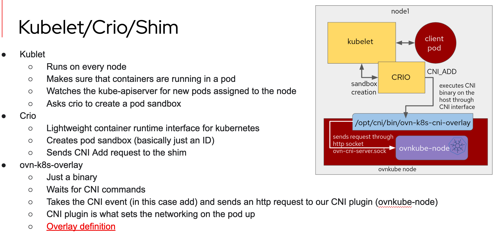
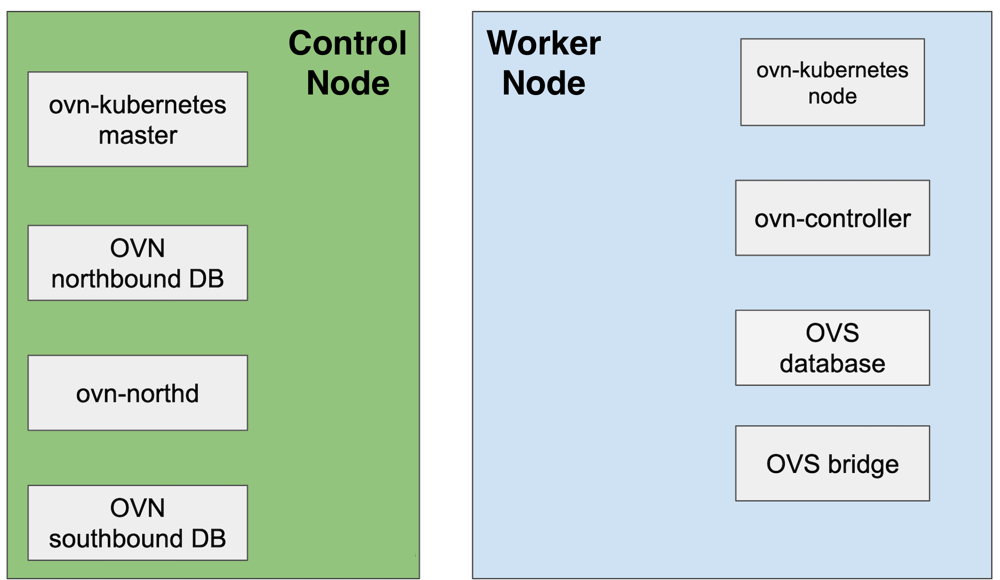

# Goal:
This talk is about the symbiotic relationship between Kubernetes and OVN.
If you know a lot about one of them, I hope to intrigue you about the other.
If you already know both, then I will do my best not to make you too sleepy.

This is intended to be a hands-on workshop, so you will need to start from
a Linux shell session to follow along.

Please join me, and interrupt at any time!

# Part 1: Getting a VM to experiment
        
There are 3 choices for this:

### 1.1) use a vm I have ready deployed. Claim one using these steps.

**NOTE:** If you are a Red Hatter, please use your "@redhat.com" email.
That will get you a VM inside the Red Hat VPN.

```bash
# make sure you can connect to the VM reservation app
$ curl reserves.flaviof.dev
Welcome to OVSCON 2022!

# claim a vm using your email address (@redhat.com if you have one!)
$ YOUR_EMAIL='' ; curl reserves.flaviof.dev/vm/${YOUR_EMAIL}
ssh vagrant@example.com -i $priv_ssh_key_file  ; # you should get something that looks like this

# get the private ssh key you will need to access the vm
$ curl reserves.flaviof.dev/key/${YOUR_EMAIL} --silent > top_secret

# make sure you got good secrets and make it private
$ grep --quiet 'PRIVATE KEY' top_secret && chmod 400 top_secret && echo ok || echo bad secrets, sad panda moment
ok

# assuming there is no 'sad panda' in getting secret, connect to vm
$ ssh vagrant@example.com -i top_secret

# You made it! please wait until others in the workshop session get in their vms too
```

### 1.2) Have Vagrant installed in your system?

If you have a system with Vagrant installed, this will do the trick:

```bash
# Note: this should take ~5 mins
$ git clone https://github.com/flavio-fernandes/ovscon22kind.git && \
  cd ovscon22kind && \
  time vagrant up --no-destroy-on-error && \
  vagrant ssh
```

### 1.3) Get your own Fedora VM
    
Create a 4Gb+ fedora-36 VM using your favorite method and run the steps
[described in this doc](https://github.com/flavio-fernandes/ovscon22kind/blob/main/docs/provisioning.md)

### 1.a) A few quick notes on what was done up to here

- Info on steps I took on a beefy bare metal to carve out vms (for option 1.1) [is here](https://github.com/flavio-fernandes/ovscon22kind/blob/main/docs/provisioning_bare.md)
- Source for the reserves application (for option 1.1) [is here](https://github.com/flavio-fernandes/ovscon22kind/tree/main/reserves)
- What got [provisioned](https://github.com/flavio-fernandes/ovscon22kind/tree/main/provision) at this point in the workshop

# Part 2: Deploy kind with OVN-Kubernetes CNI

Deploy kind cluster!
```bash
[vagrant@ovscon ~]$ tmux a || tmux
    
# Note: this should take ~5 mins
[vagrant@ovscon ~]$ cd ovn-kubernetes/contrib/ && time ./kind.sh
...
[vagrant@ovscon contrib]$ k get nodes -owide
NAME                STATUS   ROLES           AGE   VERSION   INTERNAL-IP   EXTERNAL-IP   OS-IMAGE       KERNEL-VERSION           CONTAINER-RUNTIME
ovn-control-plane   Ready    control-plane   41m   v1.24.0   172.18.0.4    <none>        Ubuntu 21.10   5.17.5-300.fc36.x86_64   containerd://1.6.4
ovn-worker          Ready    <none>          40m   v1.24.0   172.18.0.2    <none>        Ubuntu 21.10   5.17.5-300.fc36.x86_64   containerd://1.6.4
ovn-worker2         Ready    <none>          40m   v1.24.0   172.18.0.3    <none>        Ubuntu 21.10   5.17.5-300.fc36.x86_64   containerd://1.6.4
```

### 2.a) A few notes on what was done up to here

- [https://kind.sigs.k8s.io/](https://kind.sigs.k8s.io/) is a tool for running local Kubernetes clusters using Docker container "nodes"

```bash
[vagrant@ovscon contrib]$ podman ps --format="{{.Names}}"
ovn-control-plane
ovn-worker
ovn-worker2

[vagrant@ovscon ~]$ NS=$(podman inspect --format {{.State.Pid}} ovn-control-plane) ; \
                     sudo nsenter --target $NS --net --mount
# interfaces in the ovn-control-plane "node"
root@ovscon:/# ip r | grep -e ovn-k8s-mp0 -e breth0
default via 172.18.0.1 dev breth0
10.244.2.0/24 dev ovn-k8s-mp0 proto kernel scope link src 10.244.2.2    <==== AKA Mgmt, SDN interface
172.18.0.0/16 dev breth0 proto kernel scope link src 172.18.0.4         <==== AKA br-ex, node-ip 
...

# ovs runs as a pod in kind deployment (that is a little different in Openshift)
[vagrant@ovscon ~]$ kubectl get pod -n ovn-kubernetes --no-headers -o='custom-columns=PodName:.metadata.name,.Node:.spec.nodeName'
ovnkube-db-5c6757846-lt8hh        ovn-control-plane
ovnkube-master-5b5ddf8879-trw6q   ovn-control-plane
ovnkube-node-ds7xd                ovn-control-plane
ovnkube-node-xq6xd                ovn-worker
ovnkube-node-5zhvg                ovn-worker2
ovs-node-dvml9                    ovn-control-plane   <===
ovs-node-4tq5v                    ovn-worker          <===
ovs-node-85mxf                    ovn-worker2         <===

[vagrant@ovscon ~]$ POD=$(kubectl get pod -n ovn-kubernetes --no-headers -o='custom-columns=PodName:.metadata.name,.Node:.spec.nodeName' |
                     grep ovn-control-plane | grep ovs-node- | cut -d' ' -f1) ; echo $POD
ovs-node-dvml9

# what ovs sees as bridges and ports
[vagrant@ovscon ~]$ k exec -it -n ovn-kubernetes $POD -- ovs-vsctl show
428f3585-3a82-4ab8-ba28-8bf87e16551e
    Bridge br-int
        fail_mode: secure
        datapath_type: system
        Port ovn-k8s-mp0
            Interface ovn-k8s-mp0
                type: internal
        Port ovn-3d5b32-0
            Interface ovn-3d5b32-0
                type: geneve
                options: {csum="true", key=flow, remote_ip="172.18.0.2"}
        Port br-int
            Interface br-int
                type: internal
        Port ovn-0c6e9c-0
            Interface ovn-0c6e9c-0
                type: geneve
                options: {csum="true", key=flow, remote_ip="172.18.0.3"}
        Port patch-br-int-to-breth0_ovn-control-plane
            Interface patch-br-int-to-breth0_ovn-control-plane
                type: patch
                options: {peer=patch-breth0_ovn-control-plane-to-br-int}
    Bridge breth0
        fail_mode: standalone
        Port eth0
            Interface eth0
        Port patch-breth0_ovn-control-plane-to-br-int
            Interface patch-breth0_ovn-control-plane-to-br-int
                type: patch
                options: {peer=patch-br-int-to-breth0_ovn-control-plane}
        Port breth0
            Interface breth0
                type: internal
    ovs_version: "2.17.0"
```
    



## OVN-Kubernetes is a CNI

- @[Dan](https://github.com/dcbw): what is a [CNI](https://youtu.be/zChkx-AB5Xc)? :)

- [ovn-k8s-cni-overlay](https://github.com/ovn-org/ovn-kubernetes/tree/master/go-controller/cmd/ovn-k8s-cni-overlay)
- [cni configure interface start](https://github.com/ovn-org/ovn-kubernetes/blob/a282b3ac101b30f6f2927f8c4c5335b97ac2d33c/go-controller/pkg/cni/cni.go#L260)
- [cni configure interface ovs port](https://github.com/ovn-org/ovn-kubernetes/blob/a282b3ac101b30f6f2927f8c4c5335b97ac2d33c/go-controller/pkg/cni/helper_linux.go#L321)

```bash
[vagrant@ovscon ~]$ podman exec -it ovn-control-plane bash
root@ovn-control-plane:/# cd /etc/cni/net.d/
root@ovn-control-plane:/etc/cni/net.d# ls
10-ovn-kubernetes.conf
root@ovn-control-plane:/etc/cni/net.d# cat 10-ovn-kubernetes.conf
{"cniVersion":"0.4.0","name":"ovn-kubernetes","type":"ovn-k8s-cni-overlay","ipam":{},"dns":{},"logFile":"/var/log/ovn-kubernetes/ovn-k8s-cni-overlay.log","logLevel":"5","logfile-maxsize":100,"logfile-maxbackups":5
,"logfile-maxage":5}
root@ovn-control-plane:/etc/cni/net.d# cd /opt/cni/bin/
root@ovn-control-plane:/opt/cni/bin# ls
host-local  loopback  ovn-k8s-cni-overlay  portmap  ptp
```
    


```bash   
[vagrant@ovscon ~]$ k get deploy,ds -n ovn-kubernetes
NAME                             READY   UP-TO-DATE   AVAILABLE   AGE
deployment.apps/ovnkube-db       1/1     1            1           4h55m
deployment.apps/ovnkube-master   1/1     1            1           4h55m

NAME                          DESIRED   CURRENT   READY   UP-TO-DATE   AVAILABLE   NODE SELECTOR            AGE
daemonset.apps/ovnkube-node   3         3         3       3            3           kubernetes.io/os=linux   4h55m
daemonset.apps/ovs-node       3         3         3       3            3           kubernetes.io/os=linux   4h55m

[vagrant@ovscon contrib]$ k get pod -n ovn-kubernetes -owide
NAME                              READY   STATUS    RESTARTS   AGE     IP           NODE                NOMINATED NODE   READINESS GATES
ovnkube-db-5c6757846-9hg6t        2/2     Running   0          3m16s   172.18.0.4   ovn-control-plane   <none>           <none>
ovnkube-master-5b5ddf8879-thznx   2/2     Running   0          3m15s   172.18.0.4   ovn-control-plane   <none>           <none>
ovnkube-node-2jdcj                3/3     Running   0          3m15s   172.18.0.4   ovn-control-plane   <none>           <none>
ovs-node-5l9tn                    1/1     Running   0          3m16s   172.18.0.4   ovn-control-plane   <none>           <none>
ovnkube-node-sth6q                3/3     Running   0          3m15s   172.18.0.2   ovn-worker          <none>           <none>
ovs-node-vn8wz                    1/1     Running   0          3m16s   172.18.0.2   ovn-worker          <none>           <none>
ovnkube-node-59vb6                3/3     Running   0          3m15s   172.18.0.3   ovn-worker2         <none>           <none>
ovs-node-qhhzj                    1/1     Running   0          3m16s   172.18.0.3   ovn-worker2         <none>           <none>
```

#### HOST-networked pods vs POD-networked pods: the reason pod IP for ovnk pods are the same as the node ips (Bridge breth0)

```bash
[vagrant@ovscon ~]$ k get -n ovn-kubernetes deploy/ovnkube-master -oyaml | grep -n -C4 'hostNetwork: '
220-        - mountPath: /ovn-cert
221-          name: host-ovn-cert
222-          readOnly: true
223-      dnsPolicy: Default
224:      hostNetwork: true       <==================== This!
225-      priorityClassName: system-cluster-critical
226-      restartPolicy: Always
227-      schedulerName: default-scheduler
228-      securityContext: {}
```

    
### Start some cool observability tools

#### [k9s](https://k9scli.io/)
```bash
[vagrant@ovscon contrib]$ cd && wget https://github.com/derailed/k9s/releases/download/v0.26.7/k9s_Linux_x86_64.tar.gz && \
                          tar xzvf k9s_Linux_x86_64.tar.gz k9s && ./k9s
```

From K9, jump into a shell and perform the equivalent of
```bash
[vagrant@ovscon contrib]$ POD=$(kubectl get pod -n ovn-kubernetes -o jsonpath='{range .items[*]}{.metadata.name}{"\n"}{end}' | grep ovnkube-db-)
                          k exec -ti $POD -n ovn-kubernetes -c nb-ovsdb -- bash

ovn-nbctl lr-route-list ovn_cluster_router
```

#### [ovsdbmon](https://www.openvswitch.org/support/ovscon2021/slides/ovsdb_mon.pdf)
```bash
[vagrant@ovscon contrib]$ cd && git clone https://github.com/flavio-fernandes/ovsdb-mon.git -b security-admission-labels-for-namespaces && \
                          cd ovsdb-mon/dist && . ./ovsdb-mon-ovn.source

ovsdb-mon.sb list Chassis Hostname
ovsdb-mon.nb list logical_switch name
ovsdb-mon.nb
list logical_router name options
ovsdb-mon.nb -auto -no-monitor nb_global,connection
```

### Node Roles



    
=-=-=-=
    

create a pod and show kubelet logs

create a service and show dnat

do an ovnkube-trace

rebuild the code

egressip -- show snat moving when node goes down
    
=-=-=-=

```

POD=$(kubectl get pod -n ovn-kubernetes -o jsonpath='{range .items[*]}{.metadata.name}{"\n"}{end}' | grep ovnkube-db-)
k exec -ti $POD -n ovn-kubernetes -c nb-ovsdb -- bash

ovn-nbctl lr-route-list ovn_cluster_router
```

From a separate tmux session
```
```

From a separate tmux session
```
IMG="quay.io/ffernand/busybox" ; CLUSTER=ovn ; kind load docker-image $IMG --name $CLUSTER && echo ok

k run --rm -it bbox --image quay.io/ffernand/busybox -- sh

k create deploy busyb --image quay.io/ffernand/busybox --replicas=3 -- sleep infinity

k get pod -owide --show-labels --watch
k delete pod -l "app=busyb" --grace-period=0 --force
k scale deploy busyb --replicas=1
k delete deploy busyb
```


```bash
apiVersion: apps/v1
kind: DaemonSet
metadata:
  name: ovn-kubernetes-wkshp-server
  labels:
    app: webserver-agnhost-server
spec:
  selector:
      matchLabels:
        app: webserver-agnhost-server
  template:
    metadata:
      labels:
        app: webserver-agnhost-server
    spec:
      containers:
      - name: client-agnhost
        image: k8s.gcr.io/e2e-test-images/agnhost:2.26
        args: ["netexec", "--http-port=8080"]
        ports:
        - containerPort: 8080
          protocol: TCP
      - name: tools
        image: quay.io/ffernand/fedora:36
        command: ["/bin/sleep", "infinity"]
```

k exec -it ovn-kubernetes-wkshp-server-w9mg8 -c tools -- bash
dnf install -y iproute
[root@ovn-kubernetes-wkshp-server-w9mg8 /]# ss -plnt
State                    Recv-Q                   Send-Q                                      Local Address:Port                                       Peer Address:Port                   Process
LISTEN                   0                        4096                                                    *:8080                                                  *:*

[root@ovn-kubernetes-wkshp-server-w9mg8 /]# curl 10.244.2.4:8080 ; echo
NOW: 2022-11-05 19:38:23.27345274 +0000 UTC m=+341.333022531

=-=-=

experiment: modify ovs add port code and rebuild ovn-node

experiment 2: create egressip and make egress node change
