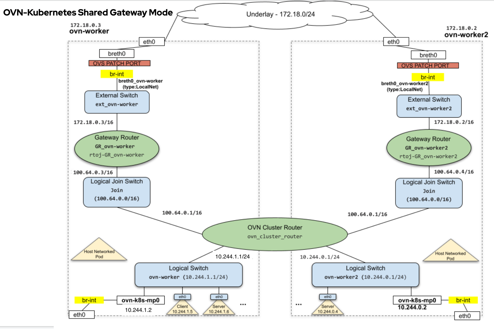

# Goal:
This talk is about the symbiotic relationship between Kubernetes and OVN.
If you know a lot about one of them, I hope to intrigue you about the other.
If you already know both, then I will do my best not to make you too sleepy.

This is intended to be a hands-on workshop, so you will need to start from
a Linux shell session to follow along.

Please join me, and interrupt at any time!

**Note:** A recording of this workshop [is available here](https://www.youtube.com/watch?v=LjAzW8C1VAU).

# Part 1: Getting a VM to experiment
        
There are 3 choices for this:

### 1.1) use a vm I have ready deployed. Claim one using these steps.

**NOTE:** If you are a Red Hatter, please use your "@redhat.com" email.
That will get you a VM inside the Red Hat VPN.

```bash
# make sure you can connect to the VM reservation app
$ curl reserves.flaviof.dev
Welcome to OVSCON 2022!

# claim a vm using your email address (@redhat.com if you have one!)
$ YOUR_EMAIL='' ; curl reserves.flaviof.dev/vm/${YOUR_EMAIL}
ssh vagrant@example.com -i $priv_ssh_key_file  ; # you should get something that looks like this

# get the private ssh key you will need to access the vm
$ curl reserves.flaviof.dev/key/${YOUR_EMAIL} --silent > top_secret

# make sure you got good secrets and make it private
$ grep --quiet 'PRIVATE KEY' top_secret && chmod 400 top_secret && echo ok || echo bad secrets, sad panda moment
ok

# assuming there is no 'sad panda' in getting secret, connect to vm
$ ssh vagrant@example.com -i top_secret

# You made it! please wait until others in the workshop session get in their vms too
```

### 1.2) Have Vagrant installed in your system?

If you have a system with Vagrant installed, this should do the trick:

```bash
# Note: this should take ~5 mins
$ git clone https://github.com/flavio-fernandes/ovscon22kind.git && \
  cd ovscon22kind && \
  time vagrant up --no-destroy-on-error && \
  vagrant ssh
```

### 1.3) Get your own Fedora VM
    
Create a 4Gb+ fedora-36 VM (or newer) using your favorite method and run the steps
[described in this doc](https://github.com/flavio-fernandes/ovscon22kind/blob/main/docs/provisioning.md).

### 1.a) A few quick notes on what was done up to here

- Info on steps I took on a beefy bare metal to carve out vms (for option 1.1) [is here](https://github.com/flavio-fernandes/ovscon22kind/blob/main/docs/provisioning_bare.md)
- Source for the reserves application (for option 1.1) [is here](https://github.com/flavio-fernandes/ovscon22kind/tree/main/reserves)
- What got [provisioned](https://github.com/flavio-fernandes/ovscon22kind/tree/main/provision) at this point in the workshop

# Part 2: Deploy kind with OVN-Kubernetes CNI

### Deploy kind cluster!

- [https://kind.sigs.k8s.io/](https://kind.sigs.k8s.io/) is a tool for running local Kubernetes clusters using Docker container "nodes"

```bash
[vagrant@ovscon  contrib]$ tmux a || tmux
    
# Note: this may take a few minutes (between 5 and 10?)
[vagrant@ovscon ~]$ cd ~/ovn-kubernetes/contrib/ && time ./kind.sh
...
Pods are all up, allowing things settle for 30 seconds...
    
[vagrant@ovscon ~]$ podman ps --format="{{.Names}}"
ovn-control-plane
ovn-worker
ovn-worker2

[vagrant@ovscon ~]$ k get nodes -owide
NAME                STATUS   ROLES           AGE   VERSION   INTERNAL-IP   EXTERNAL-IP   OS-IMAGE       KERNEL-VERSION           CONTAINER-RUNTIME
ovn-control-plane   Ready    control-plane   11h   v1.24.0   172.18.0.4    <none>        Ubuntu 21.10   5.17.5-300.fc36.x86_64   containerd://1.6.4
ovn-worker          Ready    <none>          11h   v1.24.0   172.18.0.3    <none>        Ubuntu 21.10   5.17.5-300.fc36.x86_64   containerd://1.6.4
ovn-worker2         Ready    <none>          11h   v1.24.0   172.18.0.2    <none>        Ubuntu 21.10   5.17.5-300.fc36.x86_64   containerd://1.6.4    
```
    
### Node Roles


## OVN-Kubernetes is a CNI

- @[Dan](https://github.com/dcbw): what is a [CNI](https://youtu.be/zChkx-AB5Xc)? :)

- [ovn-k8s-cni-overlay](https://github.com/ovn-org/ovn-kubernetes/tree/master/go-controller/cmd/ovn-k8s-cni-overlay)
- [cni configure interface start](https://github.com/ovn-org/ovn-kubernetes/blob/a282b3ac101b30f6f2927f8c4c5335b97ac2d33c/go-controller/pkg/cni/cni.go#L260)
- [cni configure interface ovs port](https://github.com/ovn-org/ovn-kubernetes/blob/a282b3ac101b30f6f2927f8c4c5335b97ac2d33c/go-controller/pkg/cni/helper_linux.go#L321)

```bash
[vagrant@ovscon ~]$ podman exec -it ovn-control-plane bash
    
# Configs related to CNI

root@ovn-control-plane:/# cd /etc/cni/net.d/
root@ovn-control-plane:/etc/cni/net.d# ls
10-ovn-kubernetes.conf
root@ovn-control-plane:/etc/cni/net.d# cat 10-ovn-kubernetes.conf
{"cniVersion":"0.4.0","name":"ovn-kubernetes","type":"ovn-k8s-cni-overlay","ipam":{},"dns":{},"logFile":"/var/log/ovn-kubernetes/ovn-k8s-cni-overlay.log","logLevel":"5","logfile-maxsize":100,"logfile-maxbackups":5
,"logfile-maxage":5}
root@ovn-control-plane:/etc/cni/net.d# cd /opt/cni/bin/
root@ovn-control-plane:/opt/cni/bin# ls
host-local  loopback  ovn-k8s-cni-overlay  portmap  ptp

root@ovn-control-plane:/# crictl ps
CONTAINER           IMAGE               CREATED             STATE               NAME                      ATTEMPT             POD ID              POD
56dfd7e8d98da       569771b1ac2bb       21 hours ago        Running             ovs-metrics-exporter      0                   b2f5197af97ed       ovnkube-node-cll98
ccd8b33e26f35       569771b1ac2bb       21 hours ago        Running             ovn-controller            0                   b2f5197af97ed       ovnkube-node-cll98
78baa910df1e4       569771b1ac2bb       21 hours ago        Running             ovnkube-node              0                   b2f5197af97ed       ovnkube-node-cll98
c0b431a3314c6       95a28f5a2920c       21 hours ago        Running             ovnkube-master            0                   eec46330aaaac       ovnkube-master-5b5ddf8879-sfqfz
d9c49c8dd7a1c       95a28f5a2920c       21 hours ago        Running             ovn-northd                0                   eec46330aaaac       ovnkube-master-5b5ddf8879-sfqfz
8e6f725012e70       95a28f5a2920c       21 hours ago        Running             ovs-daemons               0                   5714f66558c9e       ovs-node-tlmfh
82da3df2e4dad       95a28f5a2920c       21 hours ago        Running             sb-ovsdb                  0                   6c996fbb5f767       ovnkube-db-5c6757846-xscdh
47501de2cbf63       95a28f5a2920c       21 hours ago        Running             nb-ovsdb                  0                   6c996fbb5f767       ovnkube-db-5c6757846-xscdh
2fb8da5e484fa       aebe758cef4cd       21 hours ago        Running             etcd                      0                   fe48c15b89202       etcd-ovn-control-plane
33848b1f3664e       e5bf61ecfdbae       21 hours ago        Running             kube-controller-manager   0                   4e92c95e1fa9d       kube-controller-manager-ovn-control-plane
292bdf0cc751a       990c40faa794f       21 hours ago        Running             kube-apiserver            0                   ceb47941d732b       kube-apiserver-ovn-control-plane
40009c827947f       a4e98cc26ed1b       21 hours ago        Running             kube-scheduler            0                   a158b897b92c7       kube-scheduler-ovn-control-plane
root@ovn-control-plane:/# exit

[vagrant@ovscon ~]$ podman exec -it ovn-worker bash
root@ovn-worker:/# crictl ps
CONTAINER           IMAGE               CREATED             STATE               NAME                     ATTEMPT             POD ID              POD
4e5ace22c1a0a       569771b1ac2bb       21 hours ago        Running             ovs-metrics-exporter     0                   fe98b394c7106       ovnkube-node-ngjwh
7e3b7d338a951       569771b1ac2bb       21 hours ago        Running             ovn-controller           0                   fe98b394c7106       ovnkube-node-ngjwh
a2afc14081cd4       569771b1ac2bb       21 hours ago        Running             ovnkube-node             0                   fe98b394c7106       ovnkube-node-ngjwh
b11dbd01cf616       4c1e997385b8f       21 hours ago        Running             local-path-provisioner   0                   2b069e54f0dbb       local-path-provisioner-9cd9bd544-mpfnd
e01bdaf44aa36       a4ca41631cc7a       21 hours ago        Running             coredns                  0                   02434b78ebef3       coredns-6d4b75cb6d-z5kpn
5aae6a31ab3f3       a4ca41631cc7a       21 hours ago        Running             coredns                  0                   9ca7e36ce6a65       coredns-6d4b75cb6d-smp7z
03f4ba59a5773       95a28f5a2920c       21 hours ago        Running             ovs-daemons              0                   04797453fb85f       ovs-node-g77l8
root@ovn-worker:/# exit
```


## OVN-Kubernetes uses libovsdb

- @[Adrián](https://github.com/amorenoz), @[Dave](https://github.com/dave-tucker), @[Jaime](https://github.com/jcaamano), @[Han](https://github.com/hzhou8): what is [libovsdb](https://github.com/ovn-org/libovsdb)? :)

An OVSDB Library written in Go
    
### 2.a) A few notes on what has happened up to here

```bash
[vagrant@ovscon ~]$ NS=$(podman inspect --format {{.State.Pid}} ovn-control-plane) ; \
                    sudo nsenter --target $NS --net --mount

# interfaces in the ovn-control-plane "node"
root@ovscon:/# ip r | grep -e ovn-k8s-mp0 -e breth0
default via 172.18.0.1 dev breth0
10.244.2.0/24 dev ovn-k8s-mp0 proto kernel scope link src 10.244.2.2    <==== AKA Mgmt, SDN interface
172.18.0.0/16 dev breth0 proto kernel scope link src 172.18.0.4         <==== AKA br-ex, node-ip 
<snip>

root@ovscon:/# ip link
1: lo: <LOOPBACK,UP,LOWER_UP> mtu 65536 qdisc noqueue state UNKNOWN mode DEFAULT group default qlen 1000
    link/loopback 00:00:00:00:00:00 brd 00:00:00:00:00:00
2: ovs-system: <BROADCAST,MULTICAST> mtu 1500 qdisc noop state DOWN mode DEFAULT group default qlen 1000
    link/ether e6:eb:12:34:87:2c brd ff:ff:ff:ff:ff:ff
3: br-int: <BROADCAST,MULTICAST> mtu 1400 qdisc noop state DOWN mode DEFAULT group default qlen 1000
    link/ether 7e:47:1f:a5:25:f1 brd ff:ff:ff:ff:ff:ff
4: ovn-k8s-mp0: <BROADCAST,MULTICAST,UP,LOWER_UP> mtu 1400 qdisc noqueue state UNKNOWN mode DEFAULT group default qlen 1000
    link/ether e6:31:34:7f:03:43 brd ff:ff:ff:ff:ff:ff
5: breth0: <BROADCAST,MULTICAST,UP,LOWER_UP> mtu 1500 qdisc noqueue state UNKNOWN mode DEFAULT group default qlen 1000
    link/ether 02:42:ac:12:00:03 brd ff:ff:ff:ff:ff:ff
6: genev_sys_6081: <BROADCAST,MULTICAST,UP,LOWER_UP> mtu 65000 qdisc noqueue master ovs-system state UNKNOWN mode DEFAULT group default qlen 1000
    link/ether 56:fa:36:37:6d:9e brd ff:ff:ff:ff:ff:ff

root@ovscon:/# ss -plnt | grep kubelet
LISTEN 0      4096       127.0.0.1:10248      0.0.0.0:*    users:(("kubelet",pid=709,fd=30))
LISTEN 0      4096               *:10250            *:*    users:(("kubelet",pid=709,fd=32))

root@ovscon:/# ss -plnt | grep apiserver
LISTEN 0      4096               *:6443             *:*    users:(("kube-apiserver",pid=555,fd=7))
    
root@ovscon:/# exit  ; # do not forget to do this in order to get out of the ip ns

# Something fun to try: Use the commands above from ip ns used for ovn-workers and see how there is less 'stuff' listening there!
# NS=$(podman inspect --format {{.State.Pid}} ovn-worker) ; sudo nsenter --target $NS --net --mount
    
# ovs runs as a pod in kind deployment (that is a little different in Openshift)
[vagrant@ovscon ~]$ kubectl get pod -n ovn-kubernetes --no-headers -o='custom-columns=PodName:.metadata.name,.Node:.spec.nodeName'
ovnkube-db-5c6757846-lt8hh        ovn-control-plane
ovnkube-master-5b5ddf8879-trw6q   ovn-control-plane
ovnkube-node-ds7xd                ovn-control-plane
ovnkube-node-xq6xd                ovn-worker
ovnkube-node-5zhvg                ovn-worker2
ovs-node-dvml9                    ovn-control-plane   <===
ovs-node-4tq5v                    ovn-worker          <===
ovs-node-85mxf                    ovn-worker2         <===

[vagrant@ovscon ~]$ POD=$(k get pod -n ovn-kubernetes --no-headers -o='custom-columns=PodName:.metadata.name,.Node:.spec.nodeName' | \
                    grep ovn-control-plane | grep ovs-node- | cut -d' ' -f1) ; echo $POD
ovs-node-dvml9

# what ovs sees as bridges and ports on each one of the nodes

# breth0 is used by ovnkube-node to populate Kubernetes specific rules for
# handling north / south datapath. It needs to take into account that certain packets
# are handled by the host and others are handled at br-int; while using the host's ip address.

# The code in ovnkube-node that handles that [lives here](https://github.com/ovn-org/ovn-kubernetes/blob/e9bdbec7e7615b278793163252e9fe9ed877034e/go-controller/pkg/node/gateway_localnet.go#L21).

[vagrant@ovscon ~]$ k exec -n ovn-kubernetes -c ovs-daemons $POD -- ovs-ofctl --names dump-flows breth0 | cut -d',' -f3-
 table=0, n_packets=0, n_bytes=0, priority=500,ip,in_port="patch-breth0_ov",nw_src=172.18.0.2,nw_dst=169.254.169.2 actions=ct(commit,table=4,zone=64001,nat(dst=172.18.0.2))
 table=0, n_packets=0, n_bytes=0, priority=500,ip,in_port=LOCAL,nw_dst=169.254.169.1 actions=ct(table=5,zone=64002,nat)
 table=0, n_packets=0, n_bytes=0, priority=500,ip,in_port=LOCAL,nw_dst=10.96.0.0/16 actions=ct(commit,table=2,zone=64001,nat(src=169.254.169.2))
 table=0, n_packets=0, n_bytes=0, priority=500,ip,in_port="patch-breth0_ov",nw_src=10.96.0.0/16,nw_dst=169.254.169.2 actions=ct(table=3,zone=64001,nat)
 table=0, n_packets=0, n_bytes=0, priority=205,udp,in_port=eth0,dl_dst=02:42:ac:12:00:02,tp_dst=6081 actions=LOCAL
 table=0, n_packets=0, n_bytes=0, priority=200,udp,in_port=eth0,tp_dst=6081 actions=NORMAL
 table=0, n_packets=0, n_bytes=0, priority=200,udp,in_port=LOCAL,tp_dst=6081 actions=output:eth0
 table=0, n_packets=0, n_bytes=0, priority=100,ip,in_port="patch-breth0_ov" actions=ct(commit,zone=64000,exec(load:0x1->NXM_NX_CT_MARK[])),output:eth0
 table=0, n_packets=72694, n_bytes=44723358, priority=100,ip,in_port=LOCAL actions=ct(commit,zone=64000,exec(load:0x2->NXM_NX_CT_MARK[])),output:eth0
 table=0, n_packets=83272, n_bytes=8388111, priority=50,ip,in_port=eth0 actions=ct(table=1,zone=64000)
 table=0, n_packets=195796, n_bytes=26968782, priority=10,in_port=eth0,dl_dst=02:42:ac:12:00:02 actions=output:"patch-breth0_ov",LOCAL
 table=0, n_packets=173920, n_bytes=111810590, priority=0 actions=NORMAL
 table=1, n_packets=0, n_bytes=0, priority=100,ct_state=+est+trk,ct_mark=0x1,ip actions=check_pkt_larger(1414)->NXM_NX_REG0[0],resubmit(,11)
 table=1, n_packets=83102, n_bytes=8363790, priority=100,ct_state=+est+trk,ct_mark=0x2,ip actions=LOCAL
 table=1, n_packets=0, n_bytes=0, priority=100,ct_state=+rel+trk,ct_mark=0x1,ip actions=check_pkt_larger(1414)->NXM_NX_REG0[0],resubmit(,11)
 table=1, n_packets=0, n_bytes=0, priority=100,ct_state=+rel+trk,ct_mark=0x2,ip actions=LOCAL
 table=1, n_packets=0, n_bytes=0, priority=13,udp,in_port=eth0,tp_dst=3784 actions=output:"patch-breth0_ov",LOCAL
 table=1, n_packets=153, n_bytes=22702, priority=10,dl_dst=02:42:ac:12:00:02 actions=LOCAL
 table=1, n_packets=0, n_bytes=0, priority=0 actions=NORMAL
 table=2, n_packets=0, n_bytes=0, actions=mod_dl_dst:02:42:ac:12:00:02,output:"patch-breth0_ov"
 table=3, n_packets=0, n_bytes=0, actions=move:NXM_OF_ETH_DST[]->NXM_OF_ETH_SRC[],mod_dl_dst:02:42:ac:12:00:02,LOCAL
 table=4, n_packets=0, n_bytes=0, ip actions=ct(commit,table=3,zone=64002,nat(src=169.254.169.1))
 table=5, n_packets=0, n_bytes=0, ip actions=ct(commit,table=2,zone=64001,nat)
 table=11, n_packets=0, n_bytes=0, priority=10,reg0=0x1 actions=LOCAL
 table=11, n_packets=0, n_bytes=0, priority=1 actions=output:"patch-breth0_ov"
    
[vagrant@ovscon ~]$ k exec -n ovn-kubernetes -c ovs-daemons $POD -- ovs-vsctl show
428f3585-3a82-4ab8-ba28-8bf87e16551e
    Bridge br-int
        fail_mode: secure
        datapath_type: system
        Port ovn-k8s-mp0
            Interface ovn-k8s-mp0
                type: internal
        Port ovn-3d5b32-0
            Interface ovn-3d5b32-0
                type: geneve
                options: {csum="true", key=flow, remote_ip="172.18.0.2"}
        Port br-int
            Interface br-int
                type: internal
        Port ovn-0c6e9c-0
            Interface ovn-0c6e9c-0
                type: geneve
                options: {csum="true", key=flow, remote_ip="172.18.0.3"}
        Port patch-br-int-to-breth0_ovn-control-plane
            Interface patch-br-int-to-breth0_ovn-control-plane
                type: patch
                options: {peer=patch-breth0_ovn-control-plane-to-br-int}
    Bridge breth0
        fail_mode: standalone
        Port eth0
            Interface eth0
        Port patch-breth0_ovn-control-plane-to-br-int
            Interface patch-breth0_ovn-control-plane-to-br-int
                type: patch
                options: {peer=patch-br-int-to-breth0_ovn-control-plane}
        Port breth0
            Interface breth0
                type: internal
    ovs_version: "2.17.0"
```

## Kubernetes parts where OVN-Kubernetes main components live


```bash   
[vagrant@ovscon ~]$ k get deploy,ds -n ovn-kubernetes
NAME                             READY   UP-TO-DATE   AVAILABLE   AGE
deployment.apps/ovnkube-db       1/1     1            1           4h55m
deployment.apps/ovnkube-master   1/1     1            1           4h55m

NAME                          DESIRED   CURRENT   READY   UP-TO-DATE   AVAILABLE   NODE SELECTOR            AGE
daemonset.apps/ovnkube-node   3         3         3       3            3           kubernetes.io/os=linux   4h55m
daemonset.apps/ovs-node       3         3         3       3            3           kubernetes.io/os=linux   4h55m

[vagrant@ovscon contrib]$ k get pod -n ovn-kubernetes -owide
NAME                              READY   STATUS    RESTARTS   AGE     IP           NODE                NOMINATED NODE   READINESS GATES
ovnkube-db-5c6757846-9hg6t        2/2     Running   0          3m16s   172.18.0.4   ovn-control-plane   <none>           <none>
ovnkube-master-5b5ddf8879-thznx   2/2     Running   0          3m15s   172.18.0.4   ovn-control-plane   <none>           <none>
ovnkube-node-2jdcj                3/3     Running   0          3m15s   172.18.0.4   ovn-control-plane   <none>           <none>
ovs-node-5l9tn                    1/1     Running   0          3m16s   172.18.0.4   ovn-control-plane   <none>           <none>
ovnkube-node-sth6q                3/3     Running   0          3m15s   172.18.0.2   ovn-worker          <none>           <none>
ovs-node-vn8wz                    1/1     Running   0          3m16s   172.18.0.2   ovn-worker          <none>           <none>
ovnkube-node-59vb6                3/3     Running   0          3m15s   172.18.0.3   ovn-worker2         <none>           <none>
ovs-node-qhhzj                    1/1     Running   0          3m16s   172.18.0.3   ovn-worker2         <none>           <none>
```

#### HOST-networked pods vs POD-networked pods: the reason pod IP for ovnk pods are the same as the node ips (Bridge breth0)

```bash
[vagrant@ovscon ~]$ k get -n ovn-kubernetes deploy/ovnkube-master -oyaml | grep -n -C4 'hostNetwork: '
220-        - mountPath: /ovn-cert
221-          name: host-ovn-cert
222-          readOnly: true
223-      dnsPolicy: Default
224:      hostNetwork: true       <==================== This!
225-      priorityClassName: system-cluster-critical
226-      restartPolicy: Always
227-      schedulerName: default-scheduler
228-      securityContext: {}
```

    
### Start some cool observability tools

#### [k9s](https://k9scli.io/)
[Handy commands for using K9s](https://k9scli.io/topics/commands/)
```bash
[vagrant@ovscon ~]$ wget https://github.com/derailed/k9s/releases/download/v0.26.7/k9s_Linux_x86_64.tar.gz && \
                    tar xzvf k9s_Linux_x86_64.tar.gz k9s && ./k9s
```

Usage example: From K9, jump into a shell and perform the equivalent of
```bash
[vagrant@ovscon ~]$ POD=$(kubectl get pod -n ovn-kubernetes -o jsonpath='{range .items[*]}{.metadata.name}{"\n"}{end}' | grep ovnkube-db-)
                    k exec -ti $POD -n ovn-kubernetes -c nb-ovsdb -- bash

ovn-nbctl lr-route-list ovn_cluster_router
```

#### [ovsdbmon](https://www.openvswitch.org/support/ovscon2021/slides/ovsdb_mon.pdf)
```bash
[vagrant@ovscon ~]$ git clone https://github.com/flavio-fernandes/ovsdb-mon.git -b security-admission-labels-for-namespaces && \
                    cd ovsdb-mon/dist && . ./ovsdb-mon-ovn.source

ovsdb-mon.nb
>>>> list logical_router name options

ovsdb-mon.sb list Chassis Hostname
ovsdb-mon.nb list logical_switch name
ovsdb-mon.nb -auto -no-monitor nb_global,connection
```

**Note:** Every node has a logical switch and a logical [gateway] router that is 'local' to it.

# Part 3: Experiments!


## 3.1) The nodes have a pod subnet, making it easy to find the node where a pod lives

```bash
# node's address
[vagrant@ovscon ~]$ for i in $(kubectl get nodes -o wide |awk '{print $1}' |sed '1d'); do echo "$i" && \
                    kubectl describe node "$i" | grep k8s.ovn.org/host-addresses; done
ovn-control-plane  ==> Annotations: k8s.ovn.org/host-addresses: ["172.18.0.4","fc00:f853:ccd:e793::4"]
ovn-worker         ==> Annotations: k8s.ovn.org/host-addresses: ["172.18.0.3","fc00:f853:ccd:e793::3"]
ovn-worker2        ==> Annotations: k8s.ovn.org/host-addresses: ["172.18.0.2","fc00:f853:ccd:e793::2"]

# node's pod network subnet
[vagrant@ovscon ~]$ kubectl get node \
                    -o=jsonpath='{range .items[*]}{.metadata.name}{"\t"}{.metadata.annotations}{"\n"}{end}' | \
                    grep 'k8s.ovn.org/node-subnets'
ovn-control-plane   {<snip>"k8s.ovn.org/node-subnets":"{\"default\":[\"10.244.2.0/24\"]}",<snip>}
ovn-worker          {<snip>"k8s.ovn.org/node-subnets":"{\"default\":[\"10.244.1.0/24\"]}",<snip>}
ovn-worker2         {<snip>"k8s.ovn.org/node-subnets":"{\"default\":[\"10.244.0.0/24\"]}",<snip>}
```
    
## 3.2) Basics

The OVN+OVS+containerd parts touched when creating a pod

**Suggestion:** Keep ovsdb-mon monitoring OVN NB while doing it!

```bash
# Optional: warm up kind cluster with the image we are about to use
[vagrant@ovscon ~]$ IMG="quay.io/ffernand/busybox" ; CLUSTER=ovn ; kind load docker-image $IMG --name $CLUSTER && echo ok

[vagrant@ovscon ~]$ k run --rm -it bbox --image quay.io/ffernand/busybox \
                    --overrides='{"apiVersion": "v1", "spec": {"nodeSelector": { "kubernetes.io/hostname": "ovn-worker2" }}}' \
                    -- sh
```

```bash
[vagrant@ovscon ~]$ k get pod -owide
NAME   READY   STATUS    RESTARTS   AGE     IP           NODE          NOMINATED NODE   READINESS GATES
bbox   1/1     Running   0          5m26s   10.244.0.7   ovn-worker2   <none>           <none>
```

- Look at ovnkube-master logs

Try using k9s!
 
- Look at kubelet, cri-o in ovn-worker2

First, jump into the 'node'
```bash
[vagrant@ovscon ~]$ podman exec -it ovn-worker2 /bin/bash

root@ovn-worker2:/# journalctl -u kubelet
root@ovn-worker2:~# crictl ps
CONTAINER           IMAGE               CREATED             STATE               NAME                   ATTEMPT             POD ID              POD
d300bcd6bf58a       7a80323521ccd       43 minutes ago      Running             bbox                   0                   1d9246fc93c8f       bbox
8bdd2684af121       2317f207ad309       2 hours ago         Running             ovs-metrics-exporter   0                   64390db5b26ae       ovnkube-node-h594h
f5c3c25a76fd8       2317f207ad309       2 hours ago         Running             ovn-controller         0                   64390db5b26ae       ovnkube-node-h594h
b6d0f2508081f       2317f207ad309       2 hours ago         Running             ovnkube-node           0                   64390db5b26ae       ovnkube-node-h594h
0b050c5a6c48e       2317f207ad309       2 hours ago         Running             ovs-daemons            0                   b2e6408214819       ovs-node-9257f

root@ovn-worker2:~# crictl logs d300bcd6bf58a
root@ovn-worker2:~# crictl inspect d300bcd6bf58a
root@ovn-worker2:~# ip netns
cni-2eb238f3-fd35-30f4-6ebe-cc95ce6b0c68 (id: 1)
root@ovn-worker2:~# ip netns exec cni-2eb238f3-fd35-30f4-6ebe-cc95ce6b0c68 ip a
<snip>
2: eth0@if12: <BROADCAST,MULTICAST,UP,LOWER_UP> mtu 1400 qdisc noqueue state UP group default
    link/ether 0a:58:0a:f4:00:07 brd ff:ff:ff:ff:ff:ff link-netnsid 0
    inet 10.244.0.7/24 brd 10.244.0.255 scope global eth0
       valid_lft forever preferred_lft forever
    inet6 fe80::858:aff:fef4:7/64 scope link
       valid_lft forever preferred_lft forever

root@ovn-worker2:/# exit ; # back out of ovn-worker2 bash
```
     
- Look at ovnkube-node logs in ovn-worker2

```bash
[vagrant@ovscon ~]$ POD=$(k get pod -n ovn-kubernetes --no-headers -o='custom-columns=PodName:.metadata.name,.Node:.spec.nodeName' | \
                    grep ovn-worker2 | grep ovnkube-node- | cut -d' ' -f1) ; echo $POD

# ovn-controller container
vagrant@ovscon ~]$ k logs -n ovn-kubernetes $POD -c ovn-controller

# ovnkube-node container
vagrant@ovscon ~]$ k logs -n ovn-kubernetes $POD -c ovnkube-node | grep bbox
```

**NOTE:** POD_ID: 1d9246fc93c8f matches what crictl outputs. It is also the name of the OVS port, and known as the Container ID.

    
I1106 17:25:52.806916     834 cni.go:227] [default/bbox 1d9246fc93c8f67bd305a436663f025084dd02dbe2acdbd562792b81fb3742e3] ADD starting CNI request [default/bbox **1d9246fc93c8f**67bd305a436663f025084dd02dbe2acdbd562792b81fb3742e3]


    
I1106 17:25:52.808643     834 helper_linux.go:333] ConfigureOVS: namespace: default, podName: bbox, SandboxID: "**1d9246fc93c8f**67bd305a436663f025084dd02dbe2acdbd562792b81fb3742e3", UID: "ec80bc07-cee5-4a4c-bd09-284320c6e122", MAC: 0a:58:0a:f4:00:07, IPs: [10.244.0.7/24]

    
**NOTE:** The netns (ip namespace): cni-2eb238f3-fd35-30f4-6ebe-cc95ce6b0c68 is mentioned here

    
I1106 17:25:52.944211     834 cni.go:248] [default/bbox 1d9246fc93c8f67bd305a436663f025084dd02dbe2acdbd562792b81fb3742e3] ADD finished CNI request [default/bbox 1d9246fc93c8f67bd305a436663f025084dd02dbe2acdbd562792b81fb3742e3], result "{\"interfaces\":[{\"name\":\"1d9246fc93c8f67\",\"mac\":\"32:20:4d:a0:c1:c8\"},{\"name\":\"eth0\",\"mac\":\"0a:58:0a:f4:00:07\",\"sandbox\":\"/var/run/netns/**cni-2eb238f3-fd35-30f4-6ebe-cc95ce6b0c68**\"}],\"ips\":[{\"interface\":1,\"address\":\"10.244.0.7/24\",\"gateway\":\"10.244.0.1\"}],\"dns\":{}}", err <nil>

    
- Logical Switch and Logical Switch Port
  
```bash
[vagrant@ovscon ~]$ POD=$(kubectl get pod -n ovn-kubernetes -o jsonpath='{range .items[*]}{.metadata.name}{"\n"}{end}' | grep ovnkube-db-) ; \
                     k exec -ti $POD -n ovn-kubernetes -c nb-ovsdb -- bash
    
[root@ovn-control-plane ~]# ovn-nbctl list logical_switch ovn-worker2
<... with snips...>
_uuid               : 36adce8f-38df-4e56-8f23-71e45fd1c174
acls                : [8f861850-1756-40b9-af7f-39e8c833c885]
load_balancer       : [2c6b1d49-e7f8-4091-b1f6-dd8f0df28968]
load_balancer_group : [505350e9-50bf-4529-8fe2-63e37deb8500]
name                : ovn-worker2
other_config        : {subnet="10.244.0.0/24"}
ports               : [30b44059-65cb-40d5-abce-0c45b2464e5d, 6fec4854-d2f4-4b36-86de-9f27eac11481, bd44f900-9626-459e-8bd0-0f32841c350c]

[root@ovn-control-plane ~]# ovn-nbctl list logical_switch_port default_bbox
<... with snips...>
_uuid               : 6fec4854-d2f4-4b36-86de-9f27eac11481
addresses           : ["0a:58:0a:f4:00:07 10.244.0.7"]
external_ids        : {namespace=default, pod="true"}
name                : default_bbox
options             : {iface-id-ver="ec80bc07-cee5-4a4c-bd09-284320c6e122", requested-chassis=ovn-worker2}
port_security       : ["0a:58:0a:f4:00:07 10.244.0.7"]
type                : ""
up                  : true
```
    
- Look at openvswitch logs from ovn-worker2 and find OVS port

```bash
[vagrant@ovscon ~]$ POD=$(k get pod -n ovn-kubernetes --no-headers -o='custom-columns=PodName:.metadata.name,.Node:.spec.nodeName' | \
                    grep ovn-worker2 | grep ovs-node- | cut -d' ' -f1) ; echo $POD

[vagrant@ovscon ~]$ k logs -n ovn-kubernetes -c ovs-daemons $POD
[vagrant@ovscon ~]$ k exec -it -n ovn-kubernetes -c ovs-daemons $POD -- bash

[root@ovn-worker2 ~]# ovs-vsctl find Interface external-ids:iface-id=default_bbox

[root@ovn-worker2 ~]# ovs-vsctl -- --columns=name,ofport,external_ids list Interface
<snip>
name                : "1d9246fc93c8f67"     <---- Looks familiar? That is the POD_ID from ovnkube-node container's log!
ofport              : 9
external_ids        : {attached_mac="0a:58:0a:f4:00:07", iface-id=default_bbox, iface-id-ver="ec80bc07-cee5-4a4c-bd09-284320c6e122", ip_addresses="10.244.0.7/24", ovn-installed="true", ovn-installed-ts="1667755552858", sandbox="1d9246fc93c8f67bd305a436663f025084dd02dbe2acdbd562792b81fb3742e3"}
    
# OVS flows
[root@ovn-worker2 ~]# PODIP='10.244.0.7' ; ovs-ofctl --names dump-flows br-int | cut -d',' -f3- | grep ${PODIP}

[root@ovn-worker2 ~]# PODID='1d9246fc93c8f67' ; ovs-ofctl --names dump-flows br-int | cut -d',' -f3- | grep ${PODID}
 table=0, n_packets=75, n_bytes=5698, priority=100,in_port="1d9246fc93c8f67" actions=load:0xb->NXM_NX_REG13[],load:0x6->NXM_NX_REG11[],load:0x2->NXM_NX_REG12[],load:0x5->OXM_OF_METADATA[],load:0x3->NXM_NX_REG14[],resubmit(,8)
 table=65, n_packets=51, n_bytes=4238, priority=100,reg15=0x3,metadata=0x5 actions=output:"1d9246fc93c8f67"
```

## 3.3) Create a service
Explain the concept of a nodeport service and how OVN needs to create multiple load balancers to handle packets coming to the dedicated port at either worker node.
    
Also a good opportunity to mention that while sercvices 'vip' is long lived, the endpoints behind them can be very short lived.
A lot of awesome work has been done -- and more on the works -- by the OVN core team to acomodate this requirement.
Thanks [Dumitru](https://github.com/dceara) et all!!!

```bash
# Tell k8 that the port 8080 on bbox pod should be reachable from external traffic to a port on the nodes.

[vagrant@ovscon ~]$ kubectl expose pod bbox --port 8080 --type=NodePort

[vagrant@ovscon ~]$ k describe svc bbox
Name:                     bbox
Namespace:                default
Labels:                   run=bbox
Annotations:              <none>
Selector:                 run=bbox
Type:                     NodePort
IP Family Policy:         SingleStack
IP Families:              IPv4
IP:                       10.96.242.8
IPs:                      10.96.242.8
Port:                     <unset>  8080/TCP
TargetPort:               8080/TCP
NodePort:                 <unset>  30722/TCP    <==== This is the port on nodes that will map to pod's port 8080
Endpoints:                10.244.0.7:8080       <==== Note: there can be multiple endpoints, but only 1 [pod] in this example
```

- What the heck is '10.96.242.8' ?

The service IP range is a subnet that nodes use when exposing a service. It is an address reachable cluster-wide (aka Cluster IP).
It is specified via the api-server and percolates down to OVN-Kubernetes via a configmap:

```bash
[vagrant@ovscon ~]$ podman exec -it ovn-control-plane bash
root@ovn-control-plane:/# cat /etc/kubernetes/manifests/kube-apiserver.yaml | grep service-cluster-ip-range
    - --service-cluster-ip-range=10.96.0.0/16
root@ovn-control-plane:/# exit

[vagrant@ovscon ~]$ k get configmap -n ovn-kubernetes ovn-config -oyaml
apiVersion: v1
data:
  host_network_namespace: ovn-host-network
  k8s_apiserver: https://ovn-control-plane:6443
  mtu: "1400"
  net_cidr: 10.244.0.0/16    <---- split across the cluster nodes as /24
  svc_cidr: 10.96.0.0/16     <---- the service-cluster-ip-range!
kind: ConfigMap
metadata:
  <snip>
  name: ovn-config
  namespace: ovn-kubernetes
```

The service port configured at the node is obtained from a configuration parameter called `--service-node-port-range` (default: 30000-32767).
Kubernetes services is very well [documented here](https://kubernetes.io/docs/concepts/services-networking/service/).
        
- Looking at the OVN (Load Balancers) objects created

```
New ADD event on table: Load_Balancer
{
 UUID: "880e0422-7d73-46f9-bf3f-e4916358cc1f",
 ExternalIDs: {
  k8s.ovn.org/kind: "Service",
  k8s.ovn.org/owner: "default/bbox",
 },
 Name: "Service_default/bbox_TCP_node_router+switch_ovn-worker2",
 Protocol: "tcp",
 Vips: {
  172.18.0.2:30722: "",
 },
}

New ADD event on table: Load_Balancer
{
 UUID: "44b5a4d4-4d34-4b9b-ab2a-9d5b18d80e67",
 Name: "Service_default/bbox_TCP_node_router+switch_ovn-worker",
 <snip>
}

New ADD event on table: Load_Balancer
{
 UUID: "45fbfbd9-95c2-48c1-9428-8a6417865671",
 Name: "Service_default/bbox_TCP_node_router+switch_ovn-control-plane",
 <snip>
}

New ADD event on table: Load_Balancer
{
 UUID: "d19408c0-c8cf-4380-9c79-52be6231d75a",
 Name: "Service_default/bbox_TCP_cluster",
 <snip>
}

New UPDATE event on table: Logical_Router
 {
  UUID: "da8049d4-aaa1-4e03-a257-6179a8f0c4e2",
  ExternalIDs: {
   physical_ip: "172.18.0.2",
   physical_ips: "172.18.0.2",
  },
  LoadBalancer: [
   "2c6b1d49-e7f8-4091-b1f6-dd8f0df28968",
+  "880e0422-7d73-46f9-bf3f-e4916358cc1f",
  ],
  Name: "GR_ovn-worker2",
 }

New UPDATE event on table: Logical_Router
 {
  UUID: "3ba96400-6d48-4381-b651-1941a67e8858",
  ExternalIDs: {
   physical_ip: "172.18.0.3",
   physical_ips: "172.18.0.3",
  },
  LoadBalancer: [
   "2c6b1d49-e7f8-4091-b1f6-dd8f0df28968",
+  "44b5a4d4-4d34-4b9b-ab2a-9d5b18d80e67",
  ],
  Name: "GR_ovn-worker",
 }

New UPDATE event on table: Logical_Router
 {
  UUID: "163c1247-d16b-489c-9d7d-c0432c38ec18",
  ExternalIDs: {
   physical_ip: "172.18.0.4",
   physical_ips: "172.18.0.4",
  },
  LoadBalancer: [
   "344d6a98-670a-44d5-8c8c-1d8a1d4751b1",
+  "45fbfbd9-95c2-48c1-9428-8a6417865671",
  ],
  Name: "GR_ovn-control-plane",
 }

New UPDATE event on table: Logical_Switch
 {
  UUID: "63b77d13-99bd-447d-b2cc-9bdacd81f665",
  LoadBalancer: [
   "2c6b1d49-e7f8-4091-b1f6-dd8f0df28968",
+  "45fbfbd9-95c2-48c1-9428-8a6417865671",
  ],
  Name: "ovn-control-plane",
  OtherConfig: {
   subnet: "10.244.2.0/24",
  },
 }

New UPDATE event on table: Logical_Switch
 {
  UUID: "36adce8f-38df-4e56-8f23-71e45fd1c174",
  LoadBalancer: [
   "2c6b1d49-e7f8-4091-b1f6-dd8f0df28968",
+  "880e0422-7d73-46f9-bf3f-e4916358cc1f",
  ],
  Name: "ovn-worker2",
  OtherConfig: {
   subnet: "10.244.0.0/24",
  },
 }

New UPDATE event on table: Logical_Switch
 {
  UUID: "aa61c37d-9ea1-4194-9559-e2f4f19cd726",
  LoadBalancer: [
   "2c6b1d49-e7f8-4091-b1f6-dd8f0df28968",
+  "44b5a4d4-4d34-4b9b-ab2a-9d5b18d80e67",
  ],
  Name: "ovn-worker",
  OtherConfig: {
   subnet: "10.244.1.0/24",
  },
 }

New UPDATE event on table: Load_Balancer_Group
 {
  UUID: "505350e9-50bf-4529-8fe2-63e37deb8500",
  LoadBalancer: [
   "41defbae-25b1-4f92-8d45-fceef0e7b8a5",
   "ac2f4851-af0a-4328-9919-40ac937ccf19",
+  "d19408c0-c8cf-4380-9c79-52be6231d75a",
  ],
  Name: "clusterLBGroup",
 }

New UPDATE event on table: Load_Balancer
 {
  UUID: "44b5a4d4-4d34-4b9b-ab2a-9d5b18d80e67",
  ExternalIDs: {
   k8s.ovn.org/kind: "Service",
   k8s.ovn.org/owner: "default/bbox",
  },
  Name: "Service_default/bbox_TCP_node_router+switch_ovn-worker",
  Vips: {
-  172.18.0.3:30722: "",
+  172.18.0.3:30722: "10.244.0.7:8080",  <--- bbox pod added as endpoint and all the load balancers created
  },
 }
...  bbox pod added as endpoint and all the load balancers created
```

- Testing service access
```bash
# run netcat from busybox. Ref: https://www.varonis.com/blog/netcat-commands
/bin # IP=$(ip a show dev eth0 | grep 'inet ' | cut -d' ' -f 6) ; \
       while : ; do printf 'HTTP/1.1 200 OK\n\n%s\n' "hello from $HOSTNAME My IP is $IP" | nc -l -p 8080 -n -v ; sleep 1 ; done
```

For the client to hit that service, kind creates a network that we can use as the 'external' as far as out cluster is concerned
```bash
[vagrant@ovscon ~]$ podman network list
NETWORK ID     NAME      DRIVER    SCOPE
e00c81ecbb72   bridge    bridge    local
daec35e25826   host      host      local
a6cfabc7dee0   kind      bridge    local   <--- this one
f5c367e215f1   none      null      local

[vagrant@ovscon ~]$ podman network inspect kind | grep IPv4Address
                "IPv4Address": "172.18.0.2/16",
                "IPv4Address": "172.18.0.3/16",
                "IPv4Address": "172.18.0.4/16",

[vagrant@ovscon ~]$ podman run --rm --network kind -it quay.io/ffernand/fedora:36 bash
[root@a86a3dded27a /]# curl 172.18.0.2:30722
hello from bbox My IP is 10.244.0.7/24
[root@a86a3dded27a /]# curl 172.18.0.3:30722
hello from bbox My IP is 10.244.0.7/24
[root@a86a3dded27a /]# curl 172.18.0.4:30722
hello from bbox My IP is 10.244.0.7/24
```
    
## 3.4) Create pods from a DaemonSet (aka ds) and ping across them

For the next experiment, let's look at this diagram for a little bit. :)
    

        
**Note:** Using a reference DaemonSet from some of my Kubernetes gurus:
    - [Andrew](https://github.com/astoycos) Stoycos
    - [Surya](https://github.com/tssurya) Seetharaman
    - [Tim](https://github.com/trozet) Rozet

```bash
[vagrant@ovscon ~]$ cat << EOT > ~/ds.yaml

apiVersion: apps/v1
kind: DaemonSet
metadata:
  name: ovn-kubernetes-wkshp-server
  labels:
    app: webserver-agnhost-server
spec:
  selector:
      matchLabels:
        app: webserver-agnhost-server
  template:
    metadata:
      labels:
        app: webserver-agnhost-server
    spec:
      containers:
      - name: client-agnhost
        image: k8s.gcr.io/e2e-test-images/agnhost:2.26
        args: ["netexec", "--http-port=8080"]
        ports:
        - containerPort: 8080
          protocol: TCP
      - name: tools
        image: quay.io/ffernand/fedora:36
        command: ["/bin/sleep", "infinity"]

EOT

[vagrant@ovscon ~]$ k apply -f ds.yaml

vagrant@ovscon ovn-kubernetes]$ k get pod -o wide
NAME                                READY   STATUS    RESTARTS   AGE     IP           NODE             
bbox                                1/1     Running   0          10h     10.244.0.7   ovn-worker2      
ovn-kubernetes-wkshp-server-fkghp   2/2     Running   0          3m58s   10.244.1.6   ovn-worker       
ovn-kubernetes-wkshp-server-gjx44   2/2     Running   0          3m58s   10.244.0.8   ovn-worker2      
ovn-kubernetes-wkshp-server-llm59   2/2     Running   0          3m58s   10.244.2.3   ovn-control-plane
    
```

Using [ovnkube-trace](https://github.com/ovn-org/ovn-kubernetes/blob/master/docs/ovnkube-trace.md), let's see
how a pod on ovn-worker would get to ovn-worker2

```bash
[vagrant@ovscon ~]$ ln -s ~/ovn-kubernetes/go-controller/_output/go/bin/ovnkube-trace
[vagrant@ovscon ~]$ ./ovnkube-trace --help
Usage of ./ovnkube-trace:
  -dst string
        dest: destination pod name
  -dst-ip string
        destination IP address (meant for tests to external targets)
  -dst-namespace string
        k8s namespace of dest pod (default "default")
  -dst-port string
        dst-port: destination port (default "80")
  -kubeconfig string
        absolute path to the kubeconfig file
  -loglevel string
        loglevel: klog level (default "0")
  -ovn-config-namespace string
        namespace used by ovn-config itself
  -service string
        service: destination service name
  -src string
        src: source pod name
  -src-namespace string
        k8s namespace of source pod (default "default")
  -tcp
        use tcp transport protocol
  -udp
        use udp transport protocol

[vagrant@ovscon ~]$ k get pod --no-headers -o='custom-columns=PodName:.metadata.name,.Node:.spec.nodeName'
bbox                                ovn-worker2
ovn-kubernetes-wkshp-server-fkghp   ovn-worker
ovn-kubernetes-wkshp-server-gjx44   ovn-worker2
ovn-kubernetes-wkshp-server-llm59   ovn-control-plane

[vagrant@ovscon ~]$ POD_WORKER=$(k get pod --no-headers -o='custom-columns=PodName:.metadata.name,.Node:.spec.nodeName' | \
                     grep ovn-worker | grep -v ovn-worker2 | cut -d' ' -f1) ; echo $POD_WORKER ; \
                     POD_WORKER2=$(k get pod --no-headers -o='custom-columns=PodName:.metadata.name,.Node:.spec.nodeName' | \
                     grep ovn-worker2 | grep -v bbox | cut -d' ' -f1) ; echo $POD_WORKER2

[vagrant@ovscon ~]$ ~/ovnkube-trace \
  -src-namespace default \
  -src $POD_WORKER \
  -dst-namespace default \
  -dst $POD_WORKER2 \
  -tcp -dst-port 8080 \
  -loglevel 0 ; # level 5 will show lots of details

ovn-trace source pod to destination pod indicates success from ovn-kubernetes-wkshp-server-fkghp to ovn-kubernetes-wkshp-server-gjx44
ovn-trace destination pod to source pod indicates success from ovn-kubernetes-wkshp-server-gjx44 to ovn-kubernetes-wkshp-server-fkghp
ovs-appctl ofproto/trace source pod to destination pod indicates success from ovn-kubernetes-wkshp-server-fkghp to ovn-kubernetes-wkshp-server-gjx44
ovs-appctl ofproto/trace destination pod to source pod indicates success from ovn-kubernetes-wkshp-server-gjx44 to ovn-kubernetes-wkshp-server-fkghp
ovn-detrace source pod to destination pod indicates success from ovn-kubernetes-wkshp-server-fkghp to ovn-kubernetes-wkshp-server-gjx44
ovn-detrace destination pod to source pod indicates success from ovn-kubernetes-wkshp-server-gjx44 to ovn-kubernetes-wkshp-server-fkghp

# now try getting to bbox service
[vagrant@ovscon ~]$ ~/ovnkube-trace   -src-namespace default   -src $POD_WORKER   -dst-namespace default   -service bbox -tcp -loglevel 0
I1107 04:25:36.540263  673791 ovs.go:90] Maximum command line arguments set to: 191102
ovn-trace from source pod to service clusterIP indicates success from ovn-kubernetes-wkshp-server-fkghp to bbox
ovn-trace source pod to destination pod indicates success from ovn-kubernetes-wkshp-server-fkghp to bbox
ovn-trace destination pod to source pod indicates success from bbox to ovn-kubernetes-wkshp-server-fkghp
ovs-appctl ofproto/trace source pod to destination pod indicates success from ovn-kubernetes-wkshp-server-fkghp to bbox
ovs-appctl ofproto/trace destination pod to source pod indicates success from bbox to ovn-kubernetes-wkshp-server-fkghp
ovn-detrace source pod to destination pod indicates success from ovn-kubernetes-wkshp-server-fkghp to bbox
ovn-detrace destination pod to source pod indicates success from bbox to ovn-kubernetes-wkshp-server-fkghp

[vagrant@ovscon ~]$ POD_WORKER2_IP=$(k get pod $POD_WORKER2 --template '{{.status.podIP}}') ; echo $POD_WORKER2_IP
        
[vagrant@ovscon ~]$ k exec $POD_WORKER -c tools -- curl -i ${POD_WORKER2_IP}:8080 --silent ; echo
HTTP/1.1 200 OK
Date: Mon, 07 Nov 2022 04:32:03 GMT
Content-Length: 62
Content-Type: text/plain; charset=utf-8

NOW: 2022-11-07 04:32:03.467019665 +0000 UTC m=+1800.273252625

[vagrant@ovscon ~]$ WORKER_NODE=$(k get node ovn-worker -o jsonpath='{.status.addresses[?(@.type=="InternalIP")].address}') && \
                     NODE_PORT=$(k get svc bbox -o jsonpath={.spec.ports[0].nodePort}) ; echo "${WORKER_NODE}:${NODE_PORT}"

[vagrant@ovscon ~]$ k exec $POD_WORKER -c tools -- curl -i ${WORKER_NODE}\:${NODE_PORT} --silent
HTTP/1.1 200 OK

hello from bbox My IP is 10.244.0.7/24
```
    
## 3.5) Change and rebuild

#### Change some random code
    
```bash
[vagrant@ovscon ~]$ cd ~/ovn-kubernetes/ && cat << EOT > ~/change.patch
diff --git a/go-controller/pkg/cni/helper_linux.go b/go-controller/pkg/cni/helper_linux.go
index d0acef6..7b9c994 100644
--- a/go-controller/pkg/cni/helper_linux.go
+++ b/go-controller/pkg/cni/helper_linux.go
@@ -353,6 +353,7 @@ func ConfigureOVS(ctx context.Context, namespace, podName, hostIfaceName string,
 		fmt.Sprintf("external_ids:iface-id-ver=%s", initialPodUID),
 		fmt.Sprintf("external_ids:ip_addresses=%s", strings.Join(ipStrs, ",")),
 		fmt.Sprintf("external_ids:sandbox=%s", sandboxID),
+		fmt.Sprintf("external_ids:ovscon-year=%s", "2022"),
 	}
 
 	if len(ifInfo.VfNetdevName) != 0 {
EOT
            
[vagrant@ovscon ovn-kubernetes]$ patch -p1 < ~/change.patch && git diff

[vagrant@ovscon ovn-kubernetes]$ pushd ~/ovn-kubernetes/ && \
   make -C go-controller build && \
   cp -v ./go-controller/_output/go/bin/ovnkube ./dist/images/ovnkube && \
   podman build -t localhost/ovn-daemonset-f:dev -f ./dist/images/Dockerfile.fedora dist/images/ && \
   kind load docker-image localhost/ovn-daemonset-f:dev --name ovn && \
   kubectl delete pod -l "name=ovnkube-node" -n ovn-kubernetes && \
   popd && echo ok

[vagrant@ovscon ovn-kubernetes]$ cd ; k get pod -owide -l "name=ovnkube-node" -n ovn-kubernetes --watch

[vagrant@ovscon ~]$ k run busybee --image quay.io/ffernand/busybox \
     --overrides='{"apiVersion": "v1", "spec": {"nodeSelector": { "kubernetes.io/hostname": "ovn-worker" }}}' \
     -- sleep infinity

[vagrant@ovscon ~]$ POD=$(k get pod -n ovn-kubernetes --no-headers -o='custom-columns=PodName:.metadata.name,.Node:.spec.nodeName' | \
                    grep ovn-worker | grep -v ovn-worker2 | grep ovs-node- | cut -d' ' -f1) ; echo $POD

[vagrant@ovscon ~]$ k exec -n ovn-kubernetes -c ovs-daemons $POD -- \
    ovs-vsctl --bare --column _uuid,external-ids,ifindex find Interface external-ids:ovscon-year=2022
```

# 4) Homework
    
## 4.1) Create an Egressip and show NATs

Learn about this feature and try it out:

- [EgressIP feature](https://github.com/ovn-org/ovn-kubernetes/blob/master/docs/egress-ip.md)
- [Configuring an egress IP address](https://docs.openshift.com/container-platform/4.11/networking/ovn_kubernetes_network_provider/configuring-egress-ips-ovn.html)
        
- show routes based on where egress node is located
- show snat moving when node goes down

```bash
$ watch -d -n 3 "ovn-nbctl lr-policy-list ovn_cluster_router | grep '100 ' ; ovn-nbctl --format=csv --no-heading find nat external_ids:name=egressip"
```

## 4.2) Network Policies

OVN-Kubernetes translates Kubernetes [network policies](https://kubernetes.io/docs/concepts/services-networking/network-policies/) (NP) into OVN ACL rows.
Maybe another good topic for a workshop/talk?
There is [activity upstream related to additional enhancements](https://static.sched.com/hosted_files/kccncna2022/96/SIG-NETWORK_%20Intro%20and%20Deep%20Dive.pdf)
in this space called `Admin Network Policy (ANP)`, so it is a good time to get involved.

## 4.3) Misc K8

Try these commands and see what OVN does about it
    
```bash
k create deploy busyb --image quay.io/ffernand/busybox --replicas=3 -- sleep infinity
k get pod -owide --show-labels --watch
k delete pod -l "app=busyb" --grace-period=0 --force
k scale deploy busyb --replicas=1
k delete deploy busyb
```
